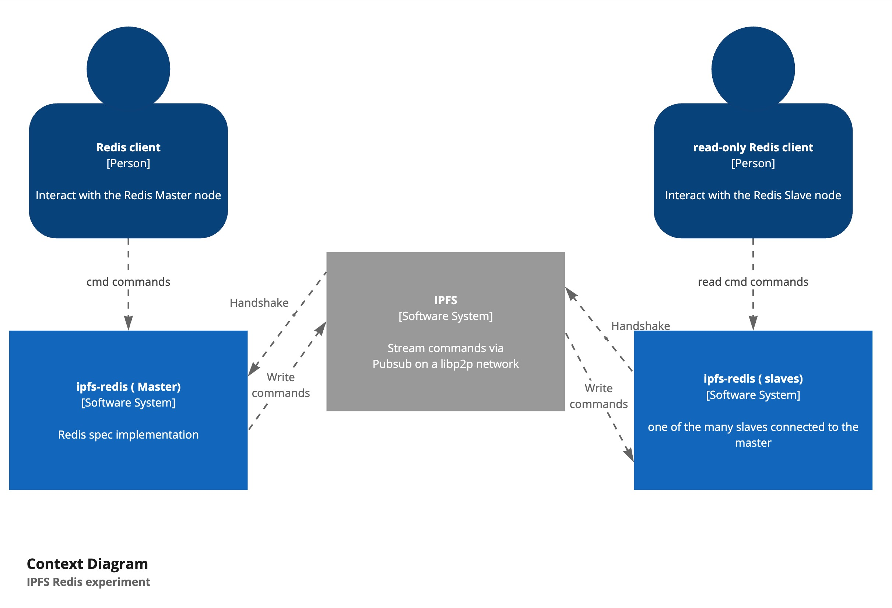

# IPFS Redis

## Overview

**IPFS Redis** is an exploratory project where I'm building my own Redis implementation from scratch with support for peer-to-peer replication using IPFS (InterPlanetary File System).

**Components**:

* **Custom Redis storage**: A basic file-based storage engine that mimics Redis data structures.
* **Replication module**: That implements the Master-Slave replication model for Redis.
* **Basic Redis commands**: A limited set of Redis commands are implemented.
* **IPFS replication**: That extend the default Redis replication with IPFS support (⚠ not fully implemented yet).

> [!WARNING]
> This project is a proof of concept (POC) to explore the feasibility and potential benefits of using IPFS for decentralized data replication in a Redis-like environment.

> [!CAUTION]
> Please note that this project is not production-ready and will never reach that stage (only limited set of the Redis Spec is implemented)!

## Why IPFS Redis vs. Traditional Redis Cluster Replication?

InterPlanetary File System ([IPFS](https://ipfs.tech/)) is a distributed protocol designed to create a peer-to-peer network,
offering many advantages compared to traditional data replication.

While using IPFS is a common practice for storing off-chain data, as seen in blockchain networks like Ethereum and Polkadot,
I believe it´s underutilized as a solution for data replication and could be an excellent solution for data replication
on restricted networks (edge computing, firewall protected enterprise networks, etc.).

### Key Advantages of IPFS:

* **High-Volume Content Distribution:**  
  IPFS is particularly well-suited for high-volume content distribution, such as streaming services.

* **Compatibility with Complex Networking:**  
  One of the core components of IPFS is the [libp2p](https://libp2p.io/) networking library, which handles complex networking scenarios like NAT traversal and firewall penetration. This is crucial for ensuring that peers behind a firewall or NATs can still communicate. It includes protocols like hole punching and relay nodes.

* **Built-in Support for Gossipsub PubSub:**  
  This enables data replication between master and slave nodes in Redis, 
  allowing for decentralized replication without relying on traditional server-client architectures.
